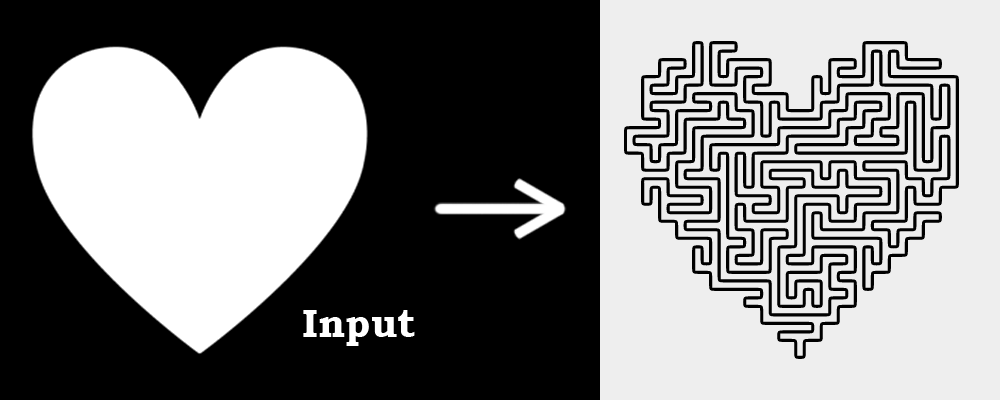

# One Line
### [Live Demo](https://adamnizol.github.io/oneline/)

One Line is a project inspired by the art style of TFoust10, in which images are drawn and filled using a single line. In an attempt to get a similar effect, I used a recursive maze generation algorithm to fill the region with a maze containing no loops/cycles. I then traced around the perimeter of the maze to get a single line representation of it.



## Instructions

#### 1. Upload a black and white image that represents the region you want to fill
#### 2. Change the available settings to your liking
#### 3. Press the 'Refresh' button to generate a new output

## How it works

### Step 1: The input image is pixelated at the specified detail level


### Step 2: The pixelated region is transformed into a maze


### Step 3: The perimeter of the maze is traced until it reaches the start


## Project Setup
```
npm install
```

### Compiles and hot-reloads for development
```
npm run serve
```

### Compiles and minifies for production
```
npm run build
``` 
